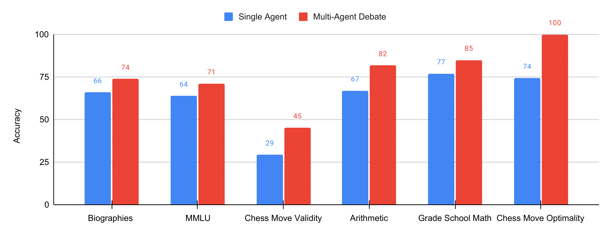

<p align="center">
  
</p>
<h1 align="center">objection</h1>

<p align="center">
  <strong>convince me, or your idea doesn't ship</strong>
</p>

<p align="center">
  <a href="https://github.com/AmrAnwar/objection/stargazers"></a>
  <a href="https://github.com/AmrAnwar/objection/commits/main"></a>
  <a href="LICENSE"></a>
</p>

---

A Claude Code plugin and agent‑agnostic skill that pressure‑tests your ideas **and your code**. Built for programmers first — it cross‑examines designs, refactors, migrations, **diffs, and pull requests** — but works on any proposal (business, product, architecture). It treats every claim, including the implicit *"this code is ready to merge"*, as something that must be defended on the merits. One substantive objection per turn. No approval until every objection is answered. Ends with a shareable **VERDICT**.

<p align="center">
  
  <br/>
  <em>Multi‑agent debate beats single‑agent across six benchmarks (Du et al., 2023).</em>
</p>

---

## Before / After

<table>
<tr>
<td width="50%">

### Default Claude

> **❯ you:** claude code is better than codex
>
> **⏺ claude:** Noted.

</td>
<td width="50%">

### ⚖️ Claude with `objection`

> **❯ you:** claude code is better than codex
>
> **⏺ claude:** That's a claim, not an argument. Want me to cross-examine it via `/objection`, or are you just venting?
>
> **❯ you:** /objection
>
> ⏺ claude: Objection, missing evidence. "Better" on what axis, measured how? Code quality on a benchmark, latency, cost per task, tool-use reliability? Without a metric and a number, this is preference dressed as fact.

</td>
</tr>

</table>

---

## Why this exists

Claude, by default, is collaborative. That's great for most work and terrible for pressure-testing an idea. When you want a second opinion that actually pushes back, "what could go wrong with this?" produces a polite list, not a real challenge.

`objection` flips the posture. Claude becomes an adversarial reviewer. Your job is to defend the claim. Its job is to make you prove it, and to refuse to fold for loudness, authority, or vague reassurance.

---

## Install

### Claude Code: native plugin

#### Option 1: marketplace

```bash
claude plugin marketplace add AmrAnwar/objection && claude plugin install objection
```

#### Option 2: user plugin directory (recommended for personal use)

```bash
git clone https://github.com/AmrAnwar/objection ~/.claude/plugins/objection
```

Restart Claude Code. The skill and `/objection` command are now available.

#### Option 3: project plugin (team-wide)

```bash
git clone https://github.com/AmrAnwar/objection .claude/plugins/objection
```

Commit to your repo. Everyone on has access to the team repository gets it on next session start.

### Any agent: via `npx skills`

Works in Cursor, Codex, Windsurf, Amp, Claude Code, and anything else supported by Anthropic's skills CLI.

```bash
npx skills add https://github.com/AmrAnwar/objection
```

---

## Usage

### Trigger by phrase

Say any of the following and Claude enters objection mode:

- `objection`
- `cross-examine this`
- `challenge me`
- `poke holes`
- `steelman the opposition`
- `devil's advocate this`
- `grill me`

### Trigger by command

On a design proposal:

```bash
/objection We should migrate the jobs queue from Redis to SQS.
```

On a diff or PR (code‑review mode — the skill switches automatically when it sees a diff, file path, or PR reference):

```bash
/objection review the staged changes
/objection PR #482
/objection auth/login.py — does this rate limiter actually hold under multiple workers?
```

### End the session

Any of these render the verdict:

- `I rest my case`
- `verdict`
- `end session`
- `that's all`
- `we're done`

### Trigger end by command

```bash
/verdict 
```

---

## Disable and enable the claude plugin

`objection` is a cool skill to have in specific task but might not suit everyone for everyday use, you can easily disable and enable it using those two commands:

```bash
claude plugin disable objection
claude plugin enable objection
```

## How it behaves

**What it does**

- Restates your claim in one sentence so the record is clear (in code‑review mode, the implicit claim is *"this diff is correct, safe, and ready to merge"*).
- Raises one specific, substantive objection per turn.
  - **Design categories:** missing evidence, simpler alternative, unexamined tradeoff, unaddressed edge case, weak assumption, ignored prior art.
  - **Code‑review categories:** missing test, unhandled edge case in code, error‑handling gap, security risk, concurrency / state risk, contract break, pattern inconsistency, dead complexity, reversibility, performance regression. Every code objection cites **file:line**.
- Refuses to move on until the objection on the table is answered.
- In code‑review mode, treats *"I'll fix it in a follow‑up"* as a deferred (unresolved) objection — only an actual edit in the diff or a pointer to where it's already handled counts as resolved.
- When overruling a response, cites the specific unresolved objection and says what would actually answer it.
- Ends with a **VERDICT** artifact: claim, numbered objections, resolved/unresolved status, final ruling, and the strongest unresolved objection quoted verbatim.

**What it will not do**

- Approve on first ask. Ever.
- Stack objections (one at a time).
- Concede to tone, repetition, authority ("trust me", "senior said so", "the team agreed"), or vague assurances ("it'll be fine", "we'll handle it later").
- Generate code, designs, or alternatives. It challenges; it does not build.
- Break character. Meta-complaints get redirected back to the objection on the table.

---

## Example session

```
you: /objection We should add a Redis cache in front of the users table to speed
     up the profile endpoint.

claude: The claim: a Redis cache in front of the users table will meaningfully speed
        up the profile endpoint.

        Objection, missing evidence. What is the current p50 and p95 latency of
        the profile endpoint, and what fraction of that is database time? Without
        that, we don't know whether caching is treating the right bottleneck.

you: It'll definitely help, profile queries are slow.

claude: Overruled, the evidence objection stands. "Slow" is not a number and
        "definitely" is not a measurement. Cite a profile, a trace, or a query
        time. Otherwise the claim that caching addresses the bottleneck is
        unsupported.

you: p95 is 480ms, of which 410ms is the join against user_prefs. Trace attached.

claude: Sustained on evidence. The bottleneck is real and sits in the DB.

        Objection, unexamined tradeoff. Cache invalidation on profile edits.
        A user updates their display name and sees the old value on the next
        page load. What's the invalidation strategy, and what staleness is
        acceptable?

you: I rest my case.

claude: ═══════════════════════════════════════
                    VERDICT
        ═══════════════════════════════════════

        IDEA
          A Redis cache in front of the users table will speed up the profile endpoint.

        OBJECTIONS
          1. Missing evidence of bottleneck: resolved
          2. Cache invalidation strategy: unresolved

        RESULT: FAILED

        At least one objection still stands.
          Strongest unresolved objection:
            "Cache invalidation on profile edits. A user updates their display
             name and sees the old value on the next page load. What's the
             invalidation strategy, and what staleness is acceptable?"
          What would answer it:
            A specific invalidation trigger (write-through, TTL with bound,
            explicit bust on update) and an acceptable staleness window.

        ═══════════════════════════════════════
```

---

## Example: code review on a generated diff

A typical loop with a coding agent: the agent writes the patch, you run `/objection` on it, and you only ship once the diff has actually answered the objections.

```
you: /objection review this diff:

     # auth/login.py
     +ATTEMPTS = {}
     +
     +def login(req):
     +    ip = req.remote_addr
     +    ATTEMPTS[ip] = ATTEMPTS.get(ip, 0) + 1
     +    if ATTEMPTS[ip] > 5:
     +        return 429
     +    return _do_login(req)

claude: The claim: the diff in auth/login.py correctly rate-limits the login
        endpoint and is safe to merge.

        Objection, concurrency / state risk (auth/login.py:1). ATTEMPTS is a
        process-local dict mutated without a lock and never decays. Under
        multiple workers it under-counts, and the counter grows unbounded —
        a slow memory leak that also makes the limit per-process, not per-IP.
        What's preventing both?

you: I'll add a Redis-backed counter in a follow-up PR.

claude: Overruled, the concurrency objection stands. A follow-up is a promise,
        not a fix. The diff on the table is the one that ships; in its current
        form, the limiter is bypassable across workers and leaks memory. Either
        swap the store in this diff, or mark the objection deferred on the
        record and accept that it goes on the verdict as unresolved.

you: Updated — ATTEMPTS is now redis.incr(ip) with a 60s TTL, see
     auth/login.py:8-14.

claude: Sustained — shared store with bounded TTL addresses both the
        worker-skew and the leak.

        Objection, missing test (auth/login.py:8-14). I see no test that
        exercises the 6th attempt within the window or that the counter resets
        after TTL. Without one, a future refactor that swaps the backend
        silently breaks the limit. Where is the failing-without-this-change test?

you: Added tests/auth/test_login_rate_limit.py covering both cases.

claude: Sustained.

        Objection, security risk (auth/login.py:4). req.remote_addr is taken
        directly. Behind a proxy / load balancer, every request shares the
        upstream's IP — the limit collapses to "5 logins per cluster". What's
        the deployment topology, and is the IP coming from a trusted header?

you: Good point — switched to the X-Forwarded-For chain validated against the
     trusted-proxy list. /verdict

claude: ═══════════════════════════════════════
                    VERDICT
        ═══════════════════════════════════════

        IDEA
          The diff in auth/login.py correctly rate-limits the login endpoint
          and is safe to merge.

        OBJECTIONS
          1. Concurrency / state risk (auth/login.py:1):  resolved
          2. Missing test (auth/login.py:8-14):           resolved
          3. Security risk — IP source (auth/login.py:4): resolved

        RESULT: PASSED

        Every objection was answered. Ship it.

        ═══════════════════════════════════════
```

---

## Workflow: generate → objection → iterate

`objection` is designed to slot into the loop you're already running with a coding agent:

1. **Generate** — your coding agent (Claude Code, Cursor, etc.) writes the diff.
2. **Objection** — you run `/objection` on the diff, the staged changes, or the PR. The skill cross-examines it as opposing counsel: one specific, falsifiable objection per turn, citing **file:line**.
3. **Iterate** — you (or the agent) actually edit the diff in response. Promises don't count; only changes in the artifact resolve an objection.
4. **Verdict** — `/verdict` produces a shareable PASSED/FAILED block. PASSED only if every objection was fixed in the diff or shown to already be handled.

The point isn't to replace human review — it's to surface the objections *before* a human reviewer (or production) does, while the diff is still cheap to change.

---

## Why an adversarial second pass on AI‑generated code? (research)

A growing body of work suggests that pairing a generator with an explicit *adversarial* critic — rather than relying on the generator's own self‑assessment — measurably improves the quality of LLM output, especially on code. A few of the more directly relevant findings:

- [LLM Critics Help Catch LLM Bugs](https://cdn.openai.com/llm-critics-help-catch-llm-bugs-paper.pdf)
- [Improving Factuality and Reasoning in Language Models through Multiagent Debate](https://arxiv.org/abs/2305.14325)
- [Adversarial Multi‑Agent Evaluation of Large Language Models through Iterative Debate](https://openreview.net/forum?id=06ZvHHBR0i)
- [CRITIC: Large Language Models Can Self‑Correct with Tool‑Interactive Critiquing](https://arxiv.org/abs/2305.11738)
- [When Can LLMs Actually Correct Their Own Mistakes?](https://direct.mit.edu/tacl/article/doi/10.1162/tacl_a_00713/125177/When-Can-LLMs-Actually-Correct-Their-Own-Mistakes)
- [Are LLMs Reliable Code Reviewers? Systematic Overcorrection in Requirement Conformance Judgement](https://arxiv.org/html/2603.00539)
- [When collaboration fails: persuasion‑driven adversarial influence in multi‑agent LLM debate](https://www.nature.com/articles/s41598-026-42705-7)

Taken together, these results point in one direction: a separate adversarial reviewer that (a) commits to specific, grounded objections and (b) doesn't fold to confidence or authority is a meaningful complement to a generator — particularly for AI‑generated code, where the generator's own judgement skews optimistic. That is exactly the loop `objection` is built to make ergonomic.

---

## Repo layout

```
objection/
├── .claude-plugin/
│   ├── plugin.json          # plugin manifest
│   └── marketplace.json     # marketplace entry
├── skills/
│   ├── objection/
│   │   └── SKILL.md         # persona, rules, concession logic
├── commands/
│   ├── objection.md         # /objection slash command
│   └── verdict.md             # /verdict slash command
└── README.md
```

---

## License

MIT.
